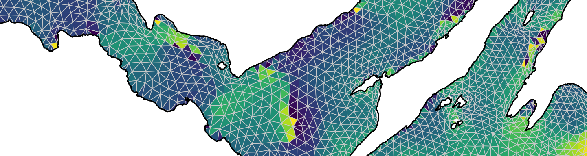

^1^  Centre for Research into Ecological and Environmental Modelling, University of St Andrews, Scotland  
^2^  Scottish Oceans Institute, University of St Andrews, Scotland  

^\*^ This repository is maintained by Edward Lavender (<el72@st-andrews.ac.uk>).

## Introduction

This repository contains methods, written in `R` and organised as an `R Project`, for Lavender et al. (2022). Benthic animal-borne sensors and citizen science combine to validate ocean modelling. Scientific Reports, 12, 16613. https://doi.org/10.1038/s41598-022-20254-z

In this paper, we used electronic tagging and tracking data from flapper skate (_Dipturus intermedius_) to validate temperature predictions from a regional hydrodynamic model---the West Scotland Coastal Ocean Modelling System (WeStCOMS) (Aleynik et al., 2016). This modelling system resolves hourly hydrodynamic conditions across an unstructured, triangular mesh that is organised into 11 vertically spaced, terrain-following Sigma layers (the 1st layer lies at the surface, the 10th layer lies at the seabed and the 11th layer lies below the seabed). Scalar variables, such as temperature, are resolved at mesh nodes. 

As part of previous research on flapper skate movement off the west coast of Scotland, forty individuals were tagged with acoustic tags (programmed to release individual-specific acoustic transmissions that could be detected by a static array of receivers) and archival tags (programmed to record depth and temperature). Using the locational information provided by acoustic detections at receivers and the temperature data from archival tags, we assembled a validation dataset for bottom temperatures across the study site that could be compared to predictions from WeStCOMS. Using temperature-depth profiles resulting from recreational catch-and-release angling, we also validated temperature-depth profiles from WeStCOMS. Both validation datasets spanned a period of time when the model forcing in WeStCOMS was independently updated, allowing us to quantify empirically the improvement in model skill resulting from the model update. 
 
## Structure

1.  **`data-raw/`** contains 'raw' data for the project:
      - `spatial/` contains spatial data; namely:
         - `coast/` contains coastline data for the UK and Ireland, sourced from the [Database of Global Administrative Areas](https://gadm.org); 
         - `bathy/` contains bathymetry data for the study site, sourced from [Digimap](https://digimap.edina.ac.uk); 
         - `mesh/` contains WeStCOMS mesh files, sourced from [Dmitry Aleynik](https://www.sams.ac.uk/people/researchers/aleynik-dr-dmitry/) at the Scottish Association for Marine Science (SAMS);
         - `mpa/` contains a shapefile of the MPA boundaries, sourced from Lavender et al. (2022);
      - WeStCOMS model predictions are also required for this project. Local files are stored externally, but can also be obtained from the [SAMS Thredds Server](https://www.sams.ac.uk/facilities/thredds/);   
      
2.  **`data/`** contains processed data and results:
      - `spatial/` contains processed spatial data, from `process_data_raw.R`;
      - `skate/` contains flapper skate movement datasets, from Lavender et al. (2022), including: 
         - `acoustics.rds` contains acoustic time series;
         - `archival*` files contain archival time series, including: 
            - `archival_raw.rds` and `archival.rds` contain archival time series;
            - `archival_following_tag_dep.rds` contains archival time series immediately following tag deployment;
            - `archival_in_middle_recap.rds` contains archival time series during angling events that occurred during individuals' time at liberty; 
            - `archival_during_final_recap.rds` contains archival time series during angling events that occurred at the end of individuals' time at liberty;  
         - `skateids.rds`, `recapture_events.rds` and `recaptures_processed.rds` contains information on tagged individuals, recapture events and recapture locations;
      - `wc/` contains results, from `analyse_*` `R` scripts (see below); 
      - `validation/` contains processed validation datasets (copied from `wc/` for publication in this repository), including:
        * `val_temp_bottom.rds` is the bottom-temperature validation dataset; 
        * `val_temp_profile_obs.rds` and `val_temp_profile_pred.rds` are the temperature-depth profile validation datasets, including observations and predictions;   

3.  **`R/`** contains scripts for data processing and analysis:
      - `define_global_param.R` defines global parameters;
      - `define_helpers.R` defines helper functions;
      - `process_data_raw.R` processes raw data;
      - `assemble_temp_bottom.R` assembles the bottom-temperature validation dataset;
      - `assemble_temp_profile.R` assembles the temperature-depth profile validation dataset;
      - `analyse_study_site.R` visualises the study site;
      - `analyse_interpolation.R` evaluates the validity of the interpolation method used for data assembly;
      - `analyse_temp_bottom_effort.R` analyses 'effort' for the bottom-temperature validation dataset;
      - `analyse_temp_bottom.R` implements the validation analysis for bottom temperatures;
      - `analyse_temp_profile.R` implements the validation analysis for temperature-depth profiles;   
      
4.  **`fig/`** contains figures.

Note that the `data-raw`, `data/*` (except `data/valiation/`) and `fig` directories are not provided in the online version of this repository.

## Workflow

1. **Setup project** by creating the directory system defined above. 

2. **Source (raw) data** via the links provided (or the authors).

3. **Define global parameters** via `define_global_param.R` and `define_helpers.R`.

4. **Process raw data** via `process_data_raw.R`. 

5. **Assemble validation datasets** via `assemble_temp_bottom.R` and `assemble_temp_profile.R`. In `assemble_temp_profile.R`, temperature-depth profiles from individuals during capture events (i.e., _ascending_ profiles) and following capture events (i.e., _descending_ profiles) are considered. Later analysis (see below) showed that the _descending_ profiles were of limited utility for validation and they were excluded from `val_temp_profile_obs.rds` and `val_temp_profile_pred.rds` (and the manuscript). 

6. **Implement analysis** via `analyse_study_site.R`, `analyse_interpolation.R`, `analyse_temp_bottom_effort.R`, `analyse_temp_bottom.R` and `analyse_temp_profile.R`.

# GitHub packages

This repository uses a number of non-default packages, available from [The Comprehensive R Archive Network](https://cran.r-project.org). These can be installed with `install.packages()`. Four packages that are only available on [GitHub](https://github.com/) are also used:

   - [`fvcom.tbx`](https://github.com/edwardlavender/fvcom.tbx). This package is used for WeStCOMS analyses. 
   - [`flapper`](https://github.com/edwardlavender/flapper). This package is used for some spatial routines.
   - [`prettyGraphics`](https://github.com/edwardlavender/prettyGraphics). This package is used for plotting. 
   - [`utils.add`](https://github.com/edwardlavender/utils.add). This package is used for summarising data. 

## References

Aleynik, D. et al. (2016). A high resolution hydrodynamic model system suitable for novel harmful algal bloom modelling in areas of complex coastline and topography. Harmful Algae 53, 102–117. https://doi.org/10.1016/j.hal.2015.11.012.

Lavender, E. (2020). fvcom.tbx: An R toolbox for the unstructured grid Finite Volume Community Ocean Model (FVCOM). R package version 0.1.0. Available at: https://github.com/edwardlavender/fvcom.tbx.

Lavender, E. et al. (2022). Behavioural responses of a large, benthic elasmobranch to catch-and-release angling. Frontiers in Marine Science, 9, 864344. https://doi.org/10.3389/fmars.2022.864344

Lavender, E. et al. (2022). Benthic animal-borne sensors and citizen science combine to validate ocean modelling. Scientific Reports, 12, 16613. https://doi.org/10.1038/s41598-022-20254-z